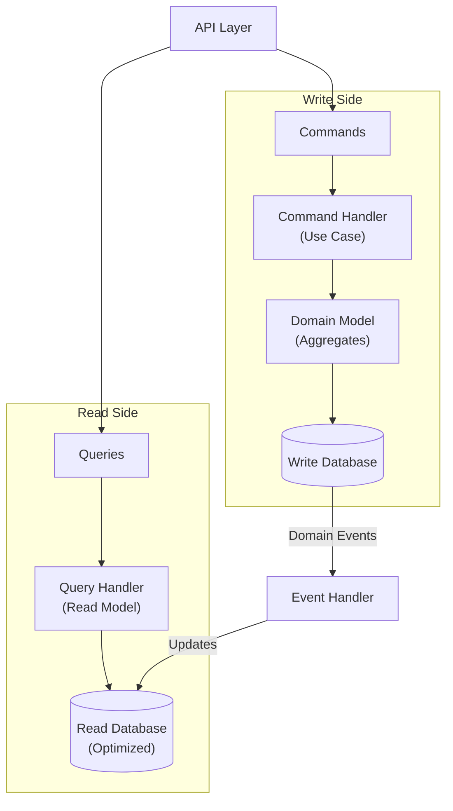

<!-- SPDX-License-Identifier: MIT -->
<!-- SPDX-FileCopyrightText: 2025-2026 Marcus Quinn -->

# CQRS & Domain Events

> [CQRS](https://martinfowler.com/bliki/CQRS.html) | [Event Sourcing](https://martinfowler.com/eaaDev/EventSourcing.html) | [CQRS Pattern](https://learn.microsoft.com/en-us/azure/architecture/patterns/cqrs) | [Transactional Outbox](https://microservices.io/patterns/data/transactional-outbox.html) | [Domain Events](https://udidahan.com/2009/06/14/domain-events-salvation/) | [Domain Events: Design & Implementation](https://learn.microsoft.com/en-us/dotnet/architecture/microservices/microservice-ddd-cqrs-patterns/domain-events-design-implementation)

## When to Use

> *"You should be very cautious about using CQRS... the majority of cases I've run into have not been so good."* — Fowler

**CQRS:** Read/write workloads diverge; complex queries don't map domain model; event sourcing in use. **Skip:** Simple CRUD, similar read/write patterns, small domain. Applies per bounded context, not system-wide.

**Event Sourcing:** Complete audit trail; point-in-time state reconstruction; inherently event-driven domain (financial, workflows). **Avoid:** Simple CRUD, unfamiliar team, retroactive addition. *"Extremely difficult to add to systems not originally designed for it."* — Fowler

**Event Sourcing requirements:** (1) Events store deltas, not final state. (2) Snapshots for performance — rebuild from snapshots, not event 0. (3) External system handling — disable notifications during replays; cache with timestamps. (4) Schema evolution — events are forever; plan versioning.

## CQRS Overview

**Commands** mutate state; **queries** retrieve data (no side effects). Read model is denormalized, query-optimized. Start with same DB and separate query paths; split databases only when proven necessary.



```typescript
// Write side — mutates state, publishes events
export class PlaceOrderHandler {
  async handle(cmd: PlaceOrderCommand): Promise<OrderId> {
    const order = Order.create(CustomerId.from(cmd.customerId));
    for (const item of cmd.items) order.addItem((await this.productRepo.findById(item.productId)).id, item.quantity);
    await this.orderRepo.save(order);
    await this.eventPublisher.publishAll(order.domainEvents);
    return order.id;
  }
}

// Read side — never mutates state
export class GetOrderHandler {
  async handle(query: { orderId: string }): Promise<OrderDTO | null> {
    return this.readDb.findById(query.orderId);
  }
}
```

## Domain Events

State-change notifications for read model updates, cross-aggregate communication, and bounded context integration.

```typescript
export abstract class DomainEvent {
  readonly eventId = crypto.randomUUID();
  readonly occurredAt = new Date();
  abstract readonly eventType: string;
  constructor(readonly aggregateId: string) {}
  abstract toPayload(): Record<string, unknown>;
}

// Carries only what changed
export class OrderConfirmed extends DomainEvent {
  readonly eventType = 'order.confirmed';
  constructor(readonly orderId: OrderId, readonly total: Money, readonly items: ReadonlyArray<{ productId: string; quantity: number }>) { super(orderId.value); }
  toPayload() { return { orderId: this.orderId.value, total: { amount: this.total.amount, currency: this.total.currency }, items: this.items }; }
}
```

```
class OrderConfirmedHandler:
    handle(event: OrderConfirmed):
        db.ordersRead.where(id: event.orderId.value).update({ status: "confirmed", total: event.total.amount, confirmedAt: event.occurredAt })
```

## Domain vs Integration Events

| | Domain Events | Integration Events |
|--|--------------|-------------------|
| Scope | Within bounded context | Cross bounded context |
| Granularity | Fine-grained | Coarse-grained |
| Transport | In-process | Message broker |
| Schema | Internal | Versioned |

Handler converts domain event to versioned integration event for the message broker:

```typescript
export class PublishOrderConfirmedIntegrationEvent {
  async handle(domainEvent: OrderConfirmed): Promise<void> {
    const order = await this.orderRepo.findById(domainEvent.orderId);
    if (!order) return;
    await this.messageBroker.publish('order-events', {
      eventType: 'sales.order.confirmed', eventId: crypto.randomUUID(), version: '1.0',
      occurredAt: new Date().toISOString(),
      payload: { orderId: order.id.value, customerId: order.customerId.value,
        total: { amount: order.total.amount, currency: order.total.currency },
        items: order.items.map(i => ({ productId: i.productId.value, quantity: i.quantity.value, unitPrice: i.unitPrice.amount })),
      },
    });
  }
}
```

## Event Dispatcher

Routes events to registered handlers. Multiple handlers per event type (fan-out).

```typescript
export class EventDispatcher {
  private handlers: Map<string, IEventHandler<any>[]> = new Map();
  register<T extends DomainEvent>(eventType: string, handler: IEventHandler<T>): void {
    this.handlers.set(eventType, [...(this.handlers.get(eventType) ?? []), handler]);
  }
  async dispatch(event: DomainEvent): Promise<void> {
    await Promise.all((this.handlers.get(event.eventType) ?? []).map(h => h.handle(event)));
  }
  async dispatchAll(events: DomainEvent[]): Promise<void> {
    for (const event of events) await this.dispatch(event);
  }
}

// Fan-out: one event type, multiple handlers
dispatcher.register('order.confirmed', new OrderConfirmedHandler(readDb));
dispatcher.register('order.confirmed', new PublishOrderConfirmedIntegrationEvent(broker, orderRepo));
```

## Outbox Pattern

Reliable event publishing: write events to outbox table in the **same transaction** as the aggregate, then publish asynchronously.

```
// Single transaction in command handler
db.transaction((tx) => {
    orderRepo.save(order, tx)
    for event in order.domainEvents:
        tx.outbox.insert({ id: event.eventId, eventType: event.eventType, payload: serialize(event.toPayload()), createdAt: event.occurredAt })
})

// Background processor
class OutboxProcessor:
    process():
        messages = db.outbox.where(processedAt: null).orderBy("createdAt").limit(100).lockForUpdate()
        for message in messages:
            messageBroker.publish(message.eventType, message.payload)
            db.outbox.where(id: message.id).update({processedAt: now()})
```

## Saga Pattern (Cross-Aggregate Workflows)

For multi-aggregate workflows, not raw event coordination. **Choreography:** each service listens/publishes events (simpler, harder to trace). **Orchestration:** central coordinator manages steps (explicit, easier to debug).

```
Saga: PlaceOrderSaga
├── Step 1: Reserve inventory (Inventory aggregate)
├── Step 2: Process payment (Payment aggregate)
├── Step 3: Confirm order (Order aggregate)
└── Compensating actions if any step fails
```

## Idempotent Consumer

**Required** — messages may be delivered more than once. Options: store processed IDs in DB, broker deduplication, or naturally idempotent handlers.

```
class OrderConfirmedHandler:
    handle(event: OrderConfirmed):
        if db.processedEvents.exists(event.eventId): return
        db.transaction((tx) => {
            doWork(event, tx)
            tx.processedEvents.insert({ id: event.eventId, processedAt: now() })
        })
```
