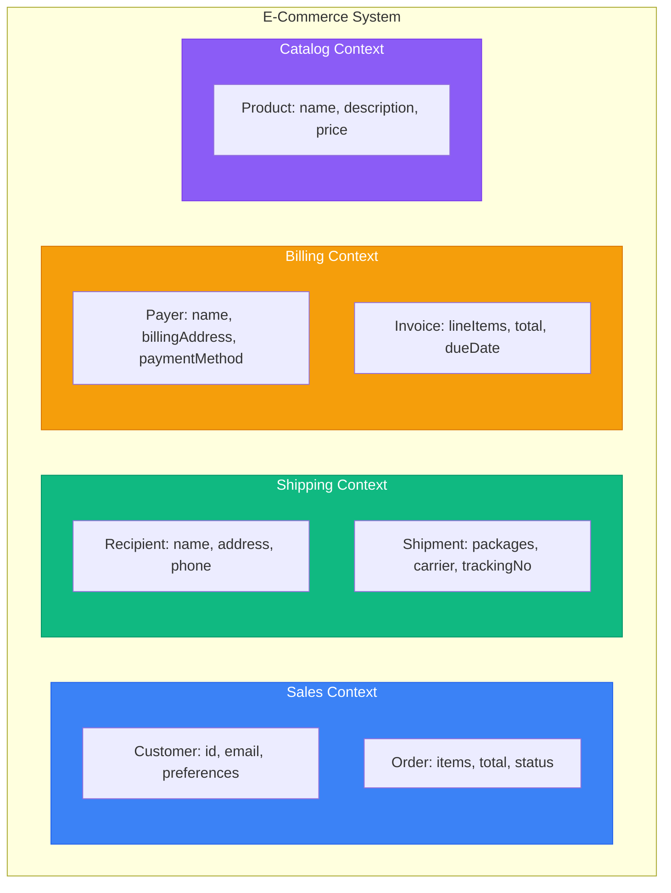
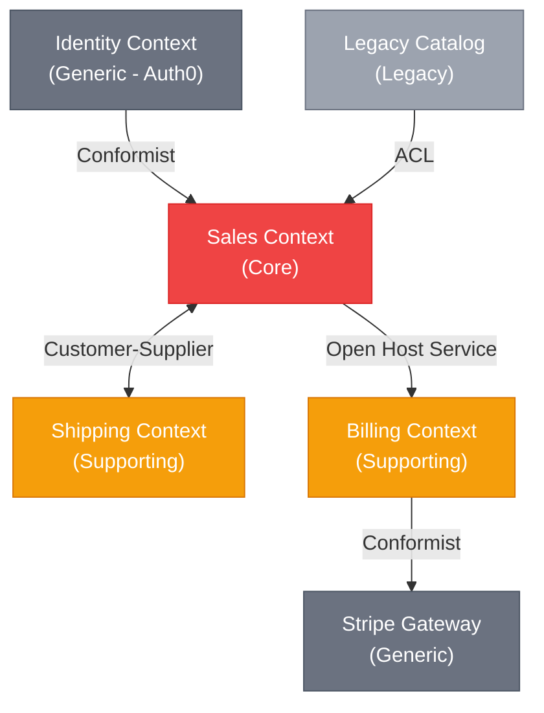

<!-- SPDX-License-Identifier: MIT -->
<!-- SPDX-FileCopyrightText: 2025-2026 Marcus Quinn -->

# DDD Strategic Patterns

> Sources: [Blue Book](https://www.domainlanguage.com/ddd/blue-book/) — Evans (2003) · [Bounded Context](https://martinfowler.com/bliki/BoundedContext.html) · [Anti-Corruption Layer](https://docs.aws.amazon.com/prescriptive-guidance/latest/cloud-design-patterns/acl.html) · [Domain Analysis for Microservices](https://learn.microsoft.com/en-us/azure/architecture/microservices/model/domain-analysis)

Strategic DDD decomposes large systems into manageable parts with clear boundaries. **DDD is fundamentally collaborative** — patterns emerge from conversations with domain experts, not from coding alone.

## Domain Discovery Techniques

### Event Storming

Workshop technique for discovering domain events, aggregates, and bounded contexts.

```
Orange sticky: Domain Event (past tense: "OrderPlaced")
Blue sticky:   Command (imperative: "Place Order")
Yellow sticky: Aggregate (noun: "Order")
Pink sticky:   External System / Policy
Purple sticky: Problem / Question
```

**Flow:** Chaotic exploration → Timeline ordering → Identify aggregates → Find boundaries (where language changes = bounded context boundary) → Surface problems

### Context Mapping Workshop

For existing systems: list all systems/services → identify team ownership → draw upstream/downstream relationships → label relationship types (ACL, Conformist, etc.) → identify pain points.

## Ubiquitous Language

Shared vocabulary between developers and domain experts appearing in code, docs, conversations, and UI.

**Principles:**
1. One language per bounded context — same word may mean different things in different contexts
2. Code reflects the language — `Order.confirm()` not `Order.setStatus("confirmed")`
3. Evolve together — when language changes, code changes

```typescript
// ❌ Technical, not ubiquitous
class Order {
  setStatus(status: number): void { this.status = status; }
}

// ✅ Ubiquitous language
class Order {
  confirm(): void {
    if (this.status !== OrderStatus.Pending) {
      throw new OrderCannotBeConfirmedException(this.id);
    }
    this.status = OrderStatus.Confirmed;
    this.confirmedAt = new Date();
    this.addDomainEvent(new OrderConfirmed(this.id));
  }
}
```

## Bounded Contexts

A **semantic boundary** where a particular domain model applies. Within a bounded context, terms have precise, unambiguous meaning. The same real-world concept may have different representations across contexts.

> **Key insight:** Polysemy across departments is natural — "the dominant boundary factor is human culture and language variation." — Martin Fowler

### Example: E-Commerce System



"Customer" means: Sales = email/preferences/history · Shipping = delivery address/phone · Billing = payment methods/billing address

In microservices, each bounded context typically becomes a separate service with its own database.

## Subdomains

Areas of business expertise. Subdomains are **discovered**, not designed.

| Type | Description | Investment | Example |
|------|-------------|------------|---------|
| **Core** | Competitive advantage | High | Product recommendation engine |
| **Supporting** | Necessary but not unique | Medium | Order management |
| **Generic** | Commodity, buy/outsource | Low | Email sending, payments |

**Identification:** What makes us different? → Core · What do we need but isn't our specialty? → Supporting · What does everyone need the same way? → Generic

## Context Mapping

Describes relationships between bounded contexts.

### Relationship Patterns

**Partnership** — Two contexts succeed or fail together. Teams coordinate closely.

**Shared Kernel** — Two contexts share a subset of the domain model. Creates coupling — use sparingly.

**Customer-Supplier** — Upstream provides what downstream needs.

**Conformist** — Downstream conforms to upstream's model with no negotiation power. Example: integrating with Stripe, AWS.

**Anti-Corruption Layer (ACL)** — Translation layer protecting your model from external models. Use when integrating with legacy systems, third-party APIs, or poorly designed external models.

```typescript
// infrastructure/external/stripe/stripe_payment_acl.ts
import Stripe from 'stripe';
import { Payment, PaymentStatus } from '@/domain/payment/payment';
import { Money } from '@/domain/shared/money';

export class StripePaymentACL {
  constructor(private readonly stripe: Stripe) {}

  async createPayment(payment: Payment): Promise<string> {
    const paymentIntent = await this.stripe.paymentIntents.create({
      amount: payment.amount.cents,
      currency: payment.amount.currency.toLowerCase(),
      metadata: {
        orderId: payment.orderId.value,
        customerId: payment.customerId.value,
      },
    });
    return paymentIntent.id;
  }

  translateStatus(stripeStatus: string): PaymentStatus {
    const mapping: Record<string, PaymentStatus> = {
      'requires_payment_method': PaymentStatus.Pending,
      'requires_confirmation': PaymentStatus.Pending,
      'requires_action': PaymentStatus.Pending,
      'processing': PaymentStatus.Processing,
      'succeeded': PaymentStatus.Completed,
      'canceled': PaymentStatus.Cancelled,
      'requires_capture': PaymentStatus.Authorized,
    };
    return mapping[stripeStatus] ?? PaymentStatus.Unknown;
  }

  translateWebhook(event: Stripe.Event): DomainEvent | null {
    switch (event.type) {
      case 'payment_intent.succeeded': {
        const intent = event.data.object as Stripe.PaymentIntent;
        return new PaymentCompleted(
          PaymentId.from(intent.metadata.orderId),
          Money.fromCents(intent.amount, intent.currency.toUpperCase())
        );
      }
      default:
        return null;
    }
  }
}
```

**Open Host Service / Published Language** — Expose a well-defined protocol (REST API, gRPC, event schema) for integration by multiple consumers.

### Context Map Diagram



## Integration Patterns

### Domain Events for Context Integration

```typescript
interface OrderPlaced {
  eventType: 'sales.order.placed';
  orderId: string;
  customerId: string;
  items: Array<{ productId: string; quantity: number; price: number }>;
  total: number;
  shippingAddress: Address;
  occurredAt: string;
}

class ShippingOrderPlacedHandler {
  async handle(event: OrderPlaced): Promise<void> {
    const shipment = Shipment.create({
      orderId: ShipmentOrderId.from(event.orderId),
      recipient: Recipient.fromAddress(event.shippingAddress),
      packages: this.calculatePackages(event.items),
    });
    await this.shipmentRepository.save(shipment);
  }
}

class BillingOrderPlacedHandler {
  async handle(event: OrderPlaced): Promise<void> {
    const invoice = Invoice.create({
      orderId: InvoiceOrderId.from(event.orderId),
      customerId: BillingCustomerId.from(event.customerId),
      lineItems: event.items.map(item => ({
        description: `Product ${item.productId}`,
        quantity: item.quantity,
        unitPrice: Money.fromNumber(item.price),
      })),
      total: Money.fromNumber(event.total),
    });
    await this.invoiceRepository.save(invoice);
  }
}
```

### Event Schema Registry

```json
{
  "$schema": "http://json-schema.org/draft-07/schema#",
  "$id": "https://api.company.com/events/sales/order-placed/v1.json",
  "title": "OrderPlaced",
  "description": "Published when an order is successfully placed",
  "type": "object",
  "required": ["eventType", "eventId", "orderId", "occurredAt"],
  "properties": {
    "eventType": { "const": "sales.order.placed" },
    "eventId": { "type": "string", "format": "uuid" },
    "orderId": { "type": "string", "format": "uuid" },
    "customerId": { "type": "string", "format": "uuid" },
    "total": { "type": "number", "minimum": 0 },
    "occurredAt": { "type": "string", "format": "date-time" }
  }
}
```

## Strategic Design Checklist

- [ ] Identify ubiquitous language terms with domain experts
- [ ] Map subdomains (core, supporting, generic)
- [ ] Define bounded context boundaries
- [ ] Document context map with relationships
- [ ] Design anti-corruption layers for external systems
- [ ] Define integration event schemas
- [ ] Ensure each context has its own data store
