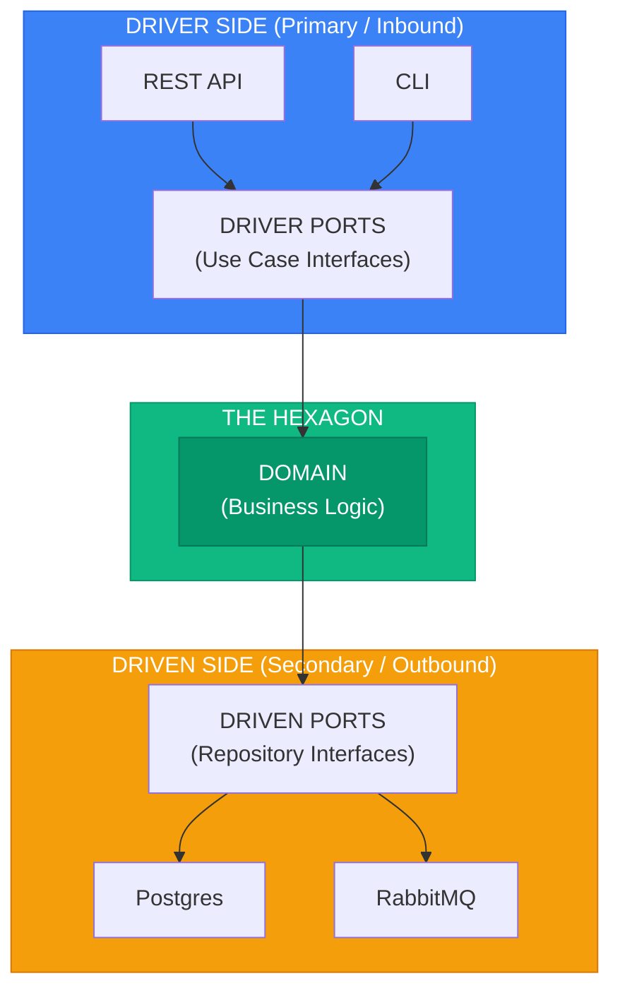

<!-- SPDX-License-Identifier: MIT -->
<!-- SPDX-FileCopyrightText: 2025-2026 Marcus Quinn -->

# Hexagonal Architecture (Ports & Adapters)

> Sources: [Cockburn 2005](https://alistair.cockburn.us/hexagonal-architecture/) · [Cockburn & Garrido de Paz 2024](https://openlibrary.org/works/OL38388131W) · [AWS](https://docs.aws.amazon.com/prescriptive-guidance/latest/cloud-design-patterns/hexagonal-architecture.html)

**Goal:** Application equally driveable by users, programs, tests, or batch scripts — developed and tested in isolation from runtime devices and databases.

**Validation:** If you can run the entire application from test fixtures (FIT-style), your hexagonal boundaries are correct.



## Ports

| Type | Direction | Defined by | Purpose | Asymmetry |
|------|-----------|------------|---------|-----------|
| **Driver** (Primary / Inbound) | → App | Application | How the world uses your app (use cases) | Adapter *calls* port — app defines what it **offers** |
| **Driven** (Secondary / Outbound) | App → | Application | What your app needs from external systems | Adapter *implements* port — app defines what it **needs** |

```typescript
// Driver ports — called by adapters, represent use cases
export interface IPlaceOrderPort { execute(command: PlaceOrderCommand): Promise<OrderId>; }
export interface IGetOrderPort { execute(query: GetOrderQuery): Promise<OrderDTO | null>; }
export interface ICancelOrderPort { execute(command: CancelOrderCommand): Promise<void>; }

// Driven ports — implemented by adapters, called by the application
export interface IOrderRepositoryPort {
  findById(id: OrderId): Promise<Order | null>;
  save(order: Order): Promise<void>;
  delete(order: Order): Promise<void>;
}
export interface IEventPublisherPort {
  publish(event: DomainEvent): Promise<void>;
  publishAll(events: DomainEvent[]): Promise<void>;
}
export interface IPaymentGatewayPort {
  charge(amount: Money, method: PaymentMethod): Promise<PaymentResult>;
  refund(paymentId: PaymentId, amount: Money): Promise<RefundResult>;
}
```

## Adapters

**Driver adapter** — converts external input → port call:

```typescript
// infrastructure/adapters/driver/rest/order_controller.ts
export class OrderController {
  constructor(private readonly placeOrder: IPlaceOrderPort, private readonly getOrder: IGetOrderPort) {}
  async create(req: Request, res: Response): Promise<void> {
    const orderId = await this.placeOrder.execute({
      customerId: req.user.id,
      items: req.body.items.map((i: any) => ({ productId: i.product_id, quantity: i.quantity })),
    });
    res.status(201).json({ id: orderId.value });
  }
}
```

**Driven adapters** — implement port interface using specific technology:

```
class PostgresOrderRepository implements IOrderRepositoryPort:
    findById(id) -> Order | null:
        row = db.orders.where(id: id.value).first()
        return row ? OrderMapper.toDomain(row) : null
    save(order): db.orders.upsert(OrderMapper.toPersistence(order))
    delete(order): db.orders.where(id: order.id.value).delete()

class InMemoryOrderRepository implements IOrderRepositoryPort:  # for tests
    orders: Map<string, Order> = {}
    findById(id): return orders.get(id.value) or null
    save(order): orders.set(order.id.value, order)
    delete(order): orders.delete(order.id.value)

class StripePaymentGateway implements IPaymentGatewayPort:
    charge(amount, method) -> PaymentResult:
        intent = stripe.paymentIntents.create({amount: amount.cents, ...})
        return PaymentResult.success(PaymentId.from(intent.id))
    refund(paymentId, amount): stripe.refunds.create({paymentIntent: paymentId.value, ...})

class RabbitMQEventPublisher implements IEventPublisherPort:
    publish(event): channel.publish("domain_events", event.eventType, serialize(event))
    publishAll(events): for event in events: publish(event)
```

## Naming Conventions

| Pattern | Port | Adapter |
|---------|------|---------|
| **Cockburn** (recommended) | `ForPlacingOrders` | `CliCommandForPlacingOrders` |
| Interface/Impl | `IOrderRepository` | `PostgresOrderRepository` |
| Port suffix | `OrderRepositoryPort` | `PostgresOrderAdapter` |
| Using prefix | `IOrderStorage` | `OrderStorageUsingPostgres` |

## Project Structure

```
src/
├── application/
│   ├── ports/
│   │   ├── driver/          # place_order_port.ts, get_order_port.ts, cancel_order_port.ts
│   │   └── driven/          # order_repository_port.ts, event_publisher_port.ts, payment_gateway_port.ts
│   └── use_cases/
│       ├── place_order/handler.ts   # implements driver port
│       └── get_order/handler.ts
├── infrastructure/adapters/
│   ├── driver/              # rest/, grpc/, cli/
│   └── driven/              # postgres/, rabbitmq/, stripe/, in_memory/
└── domain/
```

## Configurability

```typescript
// infrastructure/config/container.ts
function configureDevelopment(container: Container): void {
  container.bind<IOrderRepositoryPort>('IOrderRepositoryPort').to(InMemoryOrderRepository);
  container.bind<IEventPublisherPort>('IEventPublisherPort').to(InMemoryEventPublisher);
  container.bind<IPaymentGatewayPort>('IPaymentGatewayPort').to(FakePaymentGateway);
}
function configureProduction(container: Container): void {
  container.bind<IOrderRepositoryPort>('IOrderRepositoryPort').to(PostgresOrderRepository);
  container.bind<IEventPublisherPort>('IEventPublisherPort').to(RabbitMQEventPublisher);
  container.bind<IPaymentGatewayPort>('IPaymentGatewayPort').to(StripePaymentGateway);
}
```

## Strong vs Weak Ports

```typescript
// ❌ Weak: leaks SQL concepts into the port
interface IOrderRepository {
  findByQuery(sql: string, params: any[]): Promise<Order[]>;
}

// ✅ Strong: pure domain concepts only
interface IOrderRepository {
  findById(id: OrderId): Promise<Order | null>;
  findByCustomer(customerId: CustomerId): Promise<Order[]>;
  save(order: Order): Promise<void>;
}
```
