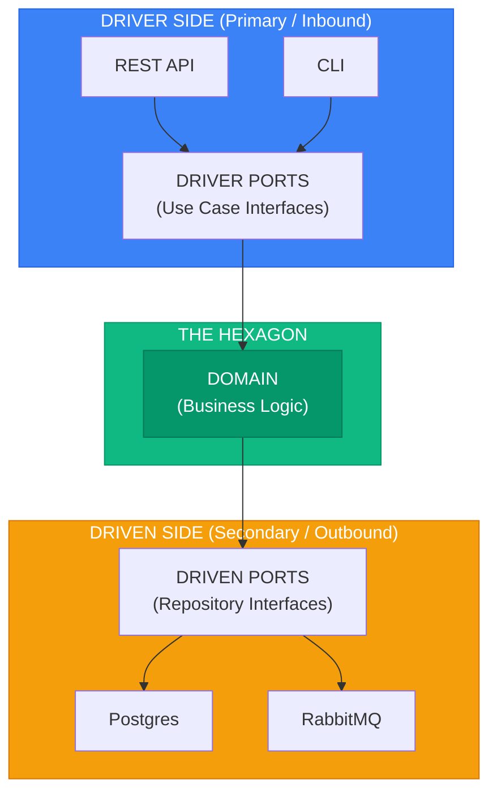

<!-- SPDX-License-Identifier: MIT -->
<!-- SPDX-FileCopyrightText: 2025-2026 Marcus Quinn -->

# Introduction

> Sources: [Cockburn 2005](https://alistair.cockburn.us/hexagonal-architecture/) · [Cockburn & Garrido de Paz 2024](https://openlibrary.org/works/OL38388131W) · [AWS](https://docs.aws.amazon.com/prescriptive-guidance/latest/cloud-design-patterns/hexagonal-architecture.html)

**Goal:** Application equally driveable by users, programs, tests, or batch scripts — developed and tested in isolation from runtime devices and databases.

**Validation:** If you can run the entire application from test fixtures (FIT-style), your hexagonal boundaries are correct.

