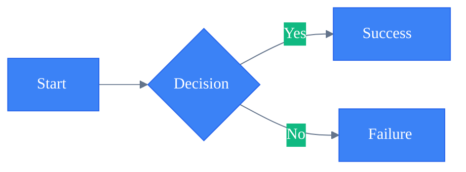
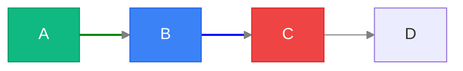
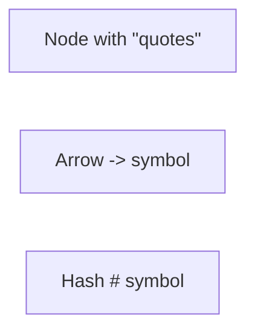
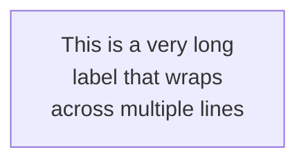

<!-- SPDX-License-Identifier: MIT -->
<!-- SPDX-FileCopyrightText: 2025-2026 Marcus Quinn -->

# Advanced Configuration & Styling

## Init Directive



## Frontmatter (alternative to init)

```yaml
---
title: My Diagram
config:
  theme: forest
  flowchart:
    defaultRenderer: elk
---
```

## Theme Variables

Themes: `default`, `dark`, `forest`, `neutral`, `base` — see cheatsheet `## Styling`.

| Variable | Description |
|----------|-------------|
| `primaryColor` | Main node fill |
| `primaryTextColor` | Text in primary nodes |
| `primaryBorderColor` | Primary node border |
| `secondaryColor` | Secondary elements |
| `tertiaryColor` | Background/tertiary |
| `lineColor` | Edge/arrow color |
| `textColor` | General text |
| `background` | Diagram background |
| `fontSize` | Base font size |
| `fontFamily` | Font family |

Diagram-specific variables:
- **Flowchart:** `nodeBorder`, `nodeTextColor`, `clusterBkg`, `clusterBorder`, `edgeLabelBackground`
- **Sequence:** `actorBorder`, `actorBkg`, `actorTextColor`, `activationBorderColor`, `activationBkgColor`, `signalColor`, `signalTextColor`, `noteBkgColor`, `noteBorderColor`, `noteTextColor`
- **State:** `labelColor`, `altBackground`
- **Gantt:** `gridColor`, `todayLineColor`, `taskTextColor`, `doneTaskBkgColor`, `activeTaskBkgColor`, `critBkgColor`, `taskBorderColor`

## Class-Based Styling


## Individual Node & Link Styling



Properties: `fill`, `stroke`, `stroke-width`, `stroke-dasharray`, `color`, `font-weight`

## Layout & Directives

**ELK Renderer (v9.4+):** Better complex layouts, predictable edge routing, improved subgraph positioning.

```
%%{init: {
  'theme': 'default',
  'flowchart': { 'defaultRenderer': 'elk', 'curve': 'basis', 'padding': 15 },
  'sequence': { 'showSequenceNumbers': true, 'actorMargin': 50, 'boxMargin': 10 },
  'gantt': { 'barHeight': 20, 'fontSize': 11, 'sectionFontSize': 14 }
}}%%
```

Directive keys: `flowchart`, `sequenceDiagram`, `classDiagram`, `stateDiagram`, `erDiagram`, `gantt`

## Security Levels

| Level | Description |
|-------|-------------|
| `strict` | Most secure, no HTML/JS |
| `loose` | Allows some interaction |
| `antiscript` | Allows HTML, blocks scripts |
| `sandbox` | iframe sandbox |

Use `securityLevel: 'loose'` to enable `click` handlers (e.g., `click A href "https://example.com" _blank`).

## Troubleshooting

**Special characters** — escape with HTML entities or use quoted strings (see cheatsheet `## Special Characters`):



**Long labels:**



**Arrow syntax by diagram type:**

| Diagram | Sync | Async | Dotted |
|---------|------|-------|--------|
| Flowchart | `-->` | N/A | `-.->` |
| Sequence | `->>` | `-->>` | `--->` |
| Class | `-->` | N/A | `..>` |
| State | `-->` | N/A | N/A |

**Debugging:** Verify diagram type declaration; check unclosed brackets/quotes; match arrow syntax to type. Start minimal, add elements one at a time to isolate the breaking change. Live editor: https://mermaid.live — export PNG/SVG for guaranteed rendering across platforms.

## Accessibility & Performance

Provide context text before diagrams for screen readers: `<div class="mermaid" role="img" aria-label="...">`. Split large diagrams; prefer class-based styling over inline; cache renders and lazy load in documentation.

## Export

| Method | Command/Usage |
|--------|--------------|
| Live editor | PNG, SVG, Markdown at https://mermaid.live |
| Programmatic | `const svg = await mermaid.render('id', diagramText)` |
| CLI | `npx @mermaid-js/mermaid-cli -i input.md -o output.svg` |
