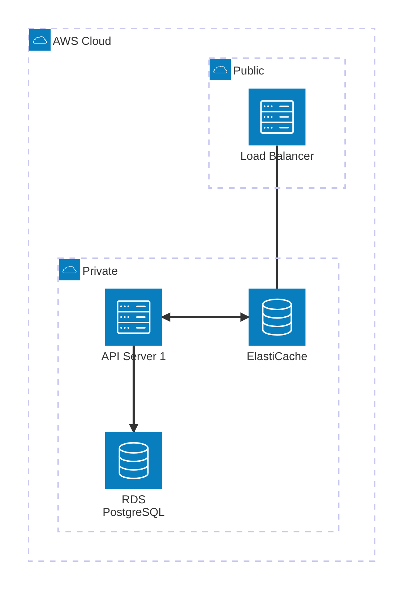
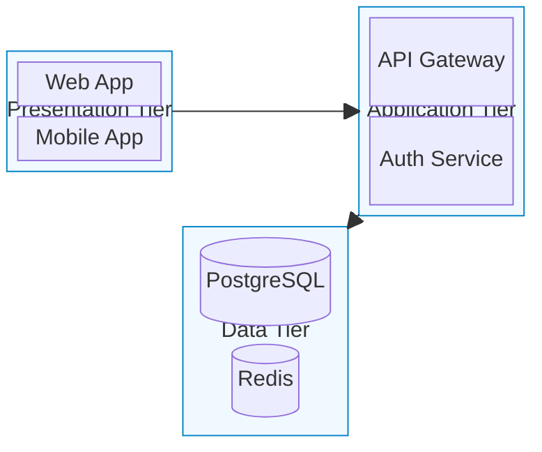
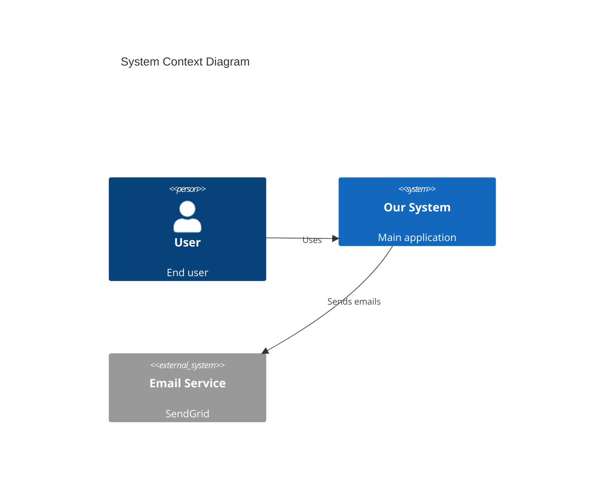
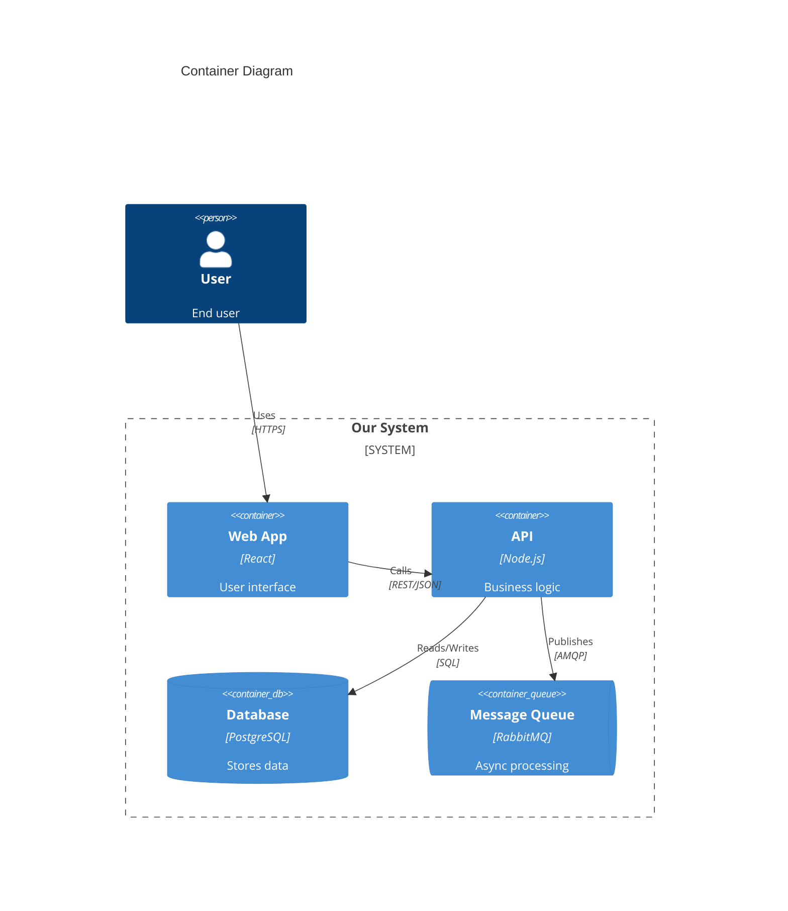
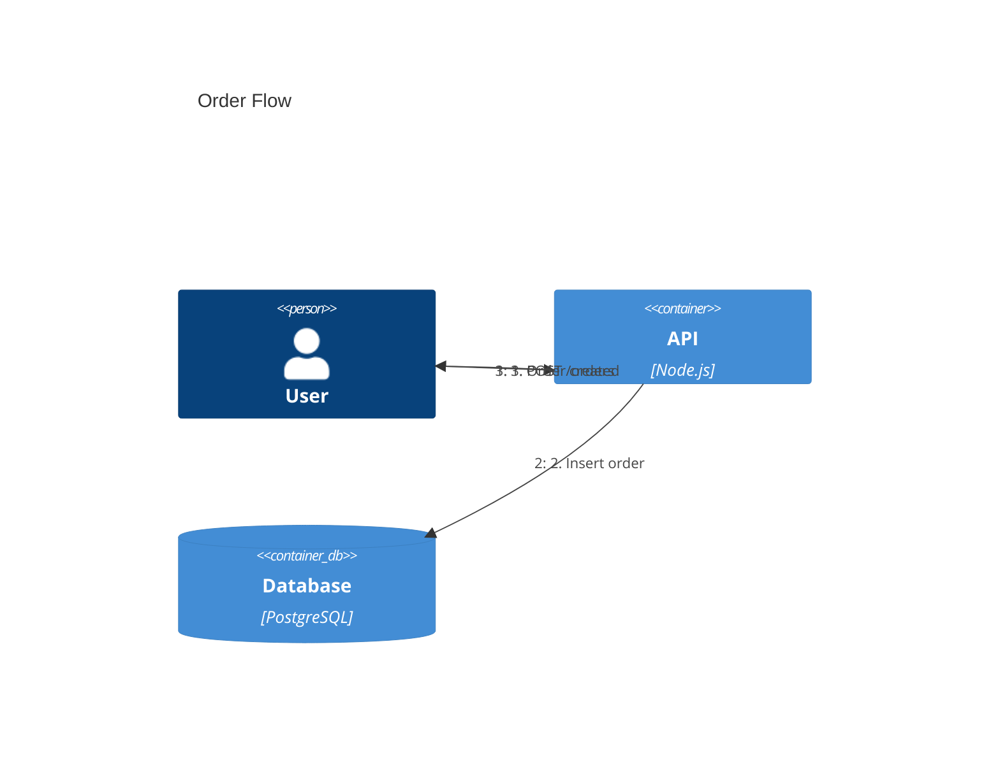
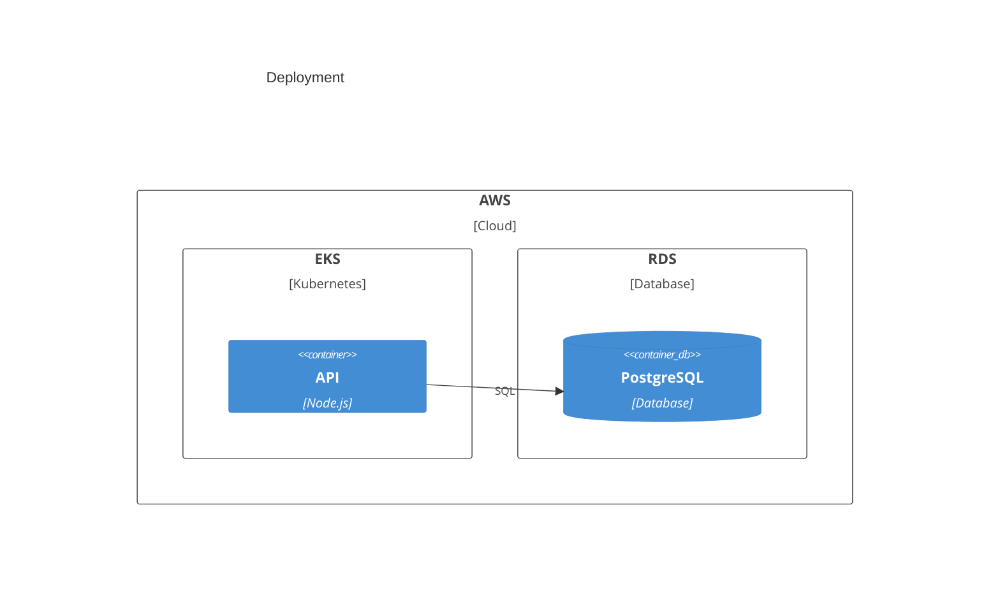
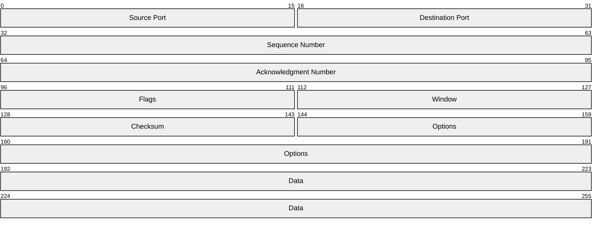

<!-- SPDX-License-Identifier: MIT -->
<!-- SPDX-FileCopyrightText: 2025-2026 Marcus Quinn -->

# Architecture Diagrams

Cloud, CI/CD, and system architecture visualization.

## Architecture-Beta

**Groups:** `group {id}({icon})[{title}]` / `group {id}({icon})[{title}] in {parent_id}`
**Services:** `service {id}({icon})[{title}]` / `service {id}({icon})[{title}] in {group_id}`
**Junctions:** `junction {id}` / `junction {id} in {group_id}`

**Edges:** `{service}:{direction} {arrow} {direction}:{service}`

| Direction | Code | Arrow | Syntax |
|-----------|------|-------|--------|
| Top | `T` | Undirected | `--` |
| Bottom | `B` | Right | `-->` |
| Left | `L` | Left | `<--` |
| Right | `R` | Bidirectional | `<-->` |

**Icons:** Built-in: `cloud`, `database`, `disk`, `internet`, `server`. Iconify (200k+): `logos:aws`, `logos:google-cloud`, etc.



## Block Diagrams

Layout-based system component diagrams with flexible positioning.

**Columns:** `columns N` — controls layout width. **Spanning:** `a:1 b:2 c:3`
**Shapes:** `["Rectangle"]` `("Rounded")` `(["Stadium"])` `[("Database")]` `(("Circle"))` `{"Diamond"}` `{{"Hexagon"}}`
**Nesting:** `block:name["Label"] ... end`
**Styling:** `classDef name fill:#hex,stroke:#hex` then `class NodeId name`



## C4 Diagrams

Software architecture using the C4 model (Context, Container, Component, Code).

**Diagram types:** `C4Context` (L1), `C4Container` (L2), `C4Component` (L3), `C4Dynamic` (interactions), `C4Deployment` (infrastructure)

**Elements:** `Person(alias, label, desc)`, `Person_Ext`, `System`, `System_Ext`, `SystemDb`, `SystemQueue`, `Boundary`, `System_Boundary`, `Enterprise_Boundary`, `Container(alias, label, tech, desc)`, `Container_Ext`, `ContainerDb`, `ContainerQueue`, `Container_Boundary`, `Deployment_Node(alias, label, tech) { ... }`

**Relationships:** `Rel(from, to, label[, tech])`, `BiRel()`, `Rel_U/D/L/R()`, `Rel_Back()`

**Styling:** `UpdateElementStyle(alias, $fontColor, $bgColor)`, `UpdateRelStyle(from, to, $textColor, $lineColor)`

### Context + Container





### Dynamic + Deployment





## Kanban

```mermaid
kanban
    Backlog
        story1[User login]
    Todo
        task1[Design login form]
        @{ ticket: AUTH-123 }
        @{ assigned: alice }
        @{ priority: High }
    In Progress
        task2[Implement login API]
    Done
        task3[Project setup]
```

**Metadata:** `ticket`, `assigned`, `priority`. Config `ticketBaseUrl` in `config.kanban` links tickets — `'https://jira.example.com/browse/#TICKET#'`.

## Packet Diagrams

Network protocol visualization. Bit ranges: absolute `0-15: "Field"` or relative `+16: "Field"`.



## Requirement Diagrams

System requirements and traceability.

**Types:** `requirement`, `functionalRequirement`, `interfaceRequirement`, `performanceRequirement`, `physicalRequirement`, `designConstraint`
**Relationships:** `contains`, `copies`, `derives`, `satisfies`, `verifies`, `refines`, `traces`

```mermaid
requirementDiagram

    requirement auth_system {
        id: REQ-100
        text: System shall provide user authentication
        risk: high
        verifymethod: test
    }

    functionalRequirement login {
        id: REQ-101
        text: Users can log in with email/password
        risk: medium
        verifymethod: test
    }

    element auth_service { type: service }
    element auth_tests { type: test_suite }

    auth_system - contains -> login
    auth_service - satisfies -> login
    auth_tests - verifies -> login
```
