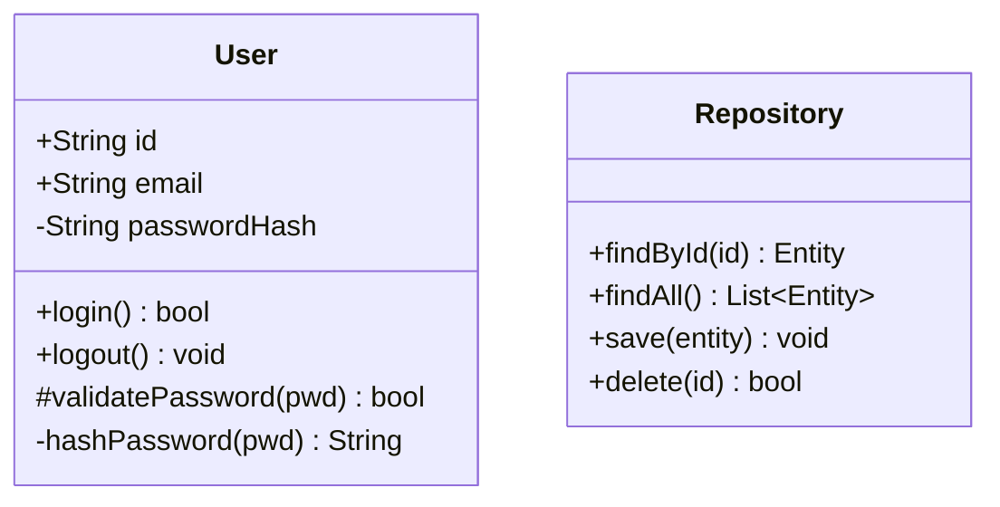
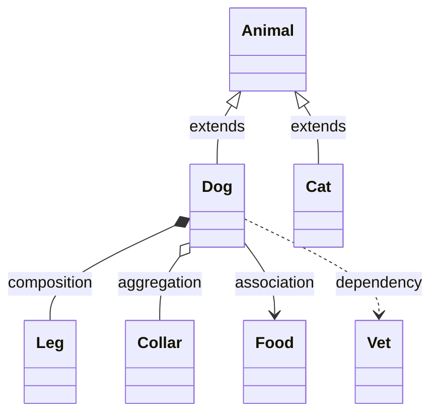
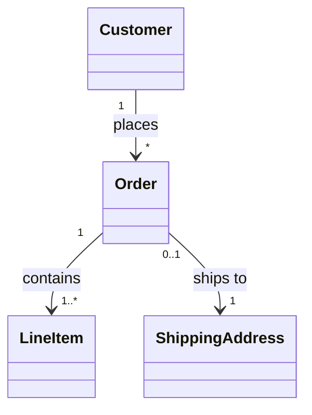
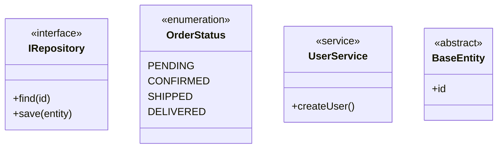
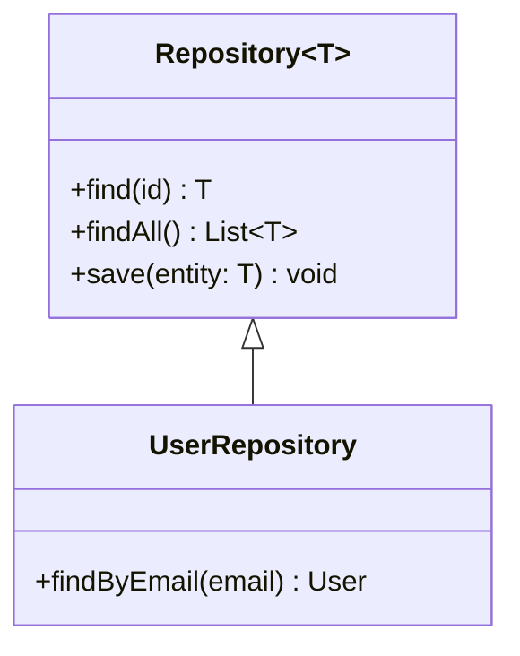
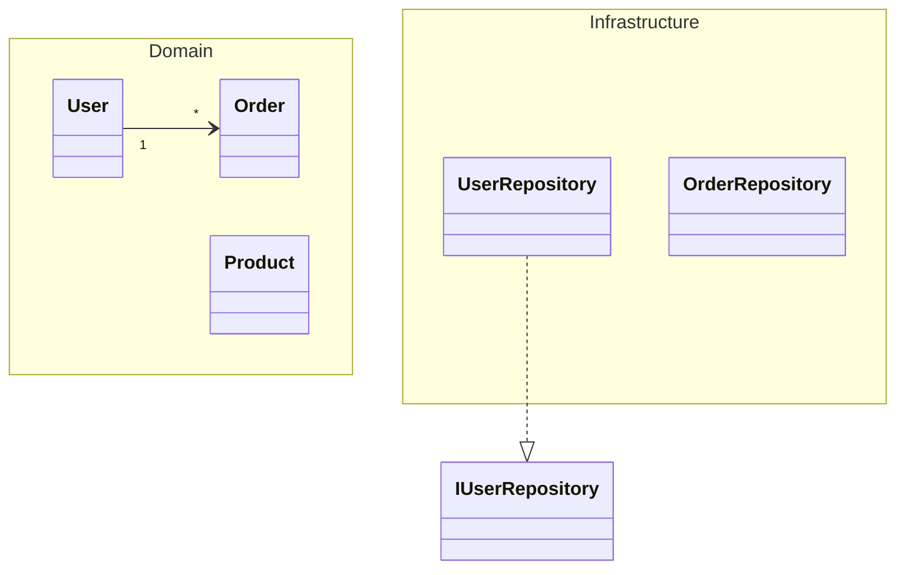
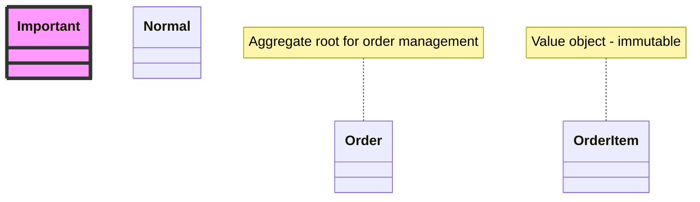
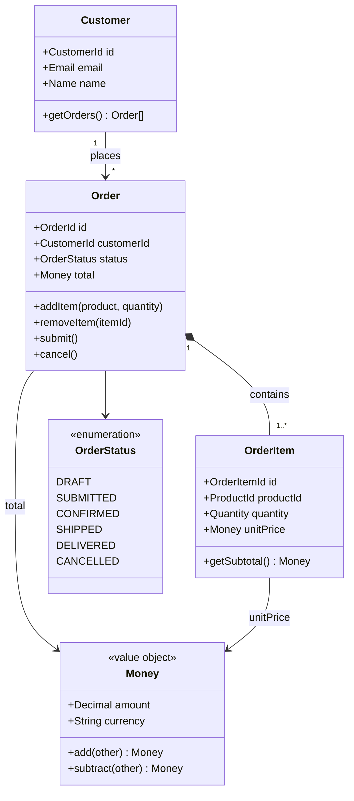
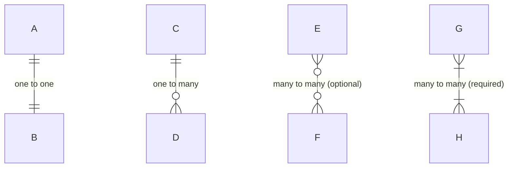
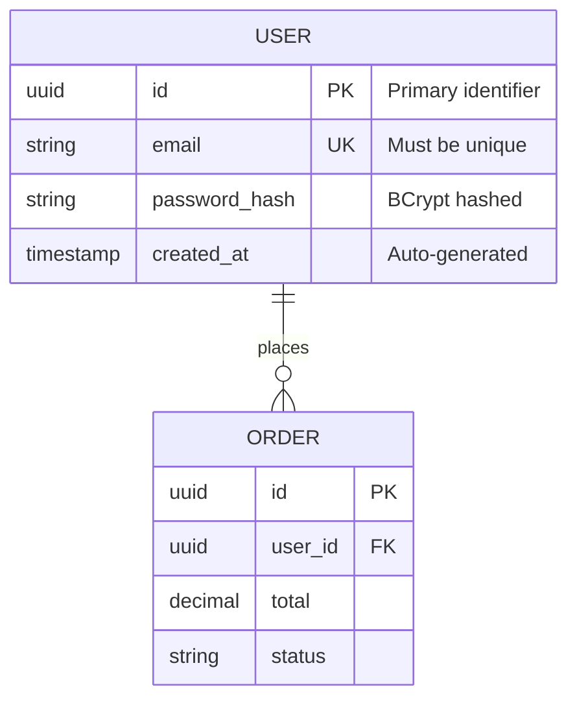

<!-- SPDX-License-Identifier: MIT -->
<!-- SPDX-FileCopyrightText: 2025-2026 Marcus Quinn -->

# Class & Entity Relationship Diagrams

Class diagrams model object-oriented structures. ER diagrams model database schemas and data relationships.

## Class Diagrams

### Definition & Members

Visibility: `+` public, `-` private, `#` protected, `~` package/internal.



### Relationships

| Syntax | Relationship |
|--------|--------------|
| `<\|--` | Inheritance (extends) |
| `*--` | Composition (owns) |
| `o--` | Aggregation (has) |
| `-->` | Association |
| `..>` | Dependency |
| `..\|>` | Realization (implements) |
| `--` | Link (solid) |
| `..` | Link (dashed) |



### Cardinality

| Notation | Meaning |
|----------|---------|
| `1` | Exactly one |
| `0..1` | Zero or one |
| `1..*` | One or more |
| `*` | Many (zero or more) |
| `n` | Specific number |
| `0..n` | Zero to n |



### Annotations



### Generic Types



### Namespaces



### Notes & Styling



### Example: Domain Model



## Entity Relationship Diagrams

### Cardinality (Crow's Foot)

| Left | Right | Meaning |
|------|-------|---------|
| `\|o` | `o\|` | Zero or one |
| `\|\|` | `\|\|` | Exactly one |
| `}o` | `o{` | Zero or more |
| `}\|` | `\|{` | One or more |

Line types: `--` (identifying/strong), `..` (non-identifying/weak).



### Entity Attributes

Modifiers: `PK` (primary key), `FK` (foreign key), `UK` (unique key).



### Example: E-Commerce Schema

```mermaid
erDiagram
    USER ||--o{ ORDER : places
    USER ||--o{ ADDRESS : has
    USER ||--o{ CART : has
    ORDER ||--|{ ORDER_ITEM : contains
    ORDER ||--o| SHIPPING : "shipped via"
    ORDER }o--|| ADDRESS : "ships to"
    PRODUCT ||--o{ ORDER_ITEM : "ordered as"
    PRODUCT ||--o{ CART_ITEM : "added to"
    PRODUCT }o--|| CATEGORY : "belongs to"
    CART ||--|{ CART_ITEM : contains

    USER { uuid id PK; string email UK; string password_hash; string name; boolean is_active; timestamp created_at; timestamp updated_at }
    ADDRESS { uuid id PK; uuid user_id FK; string street; string city; string state; string postal_code; string country; boolean is_default }
    PRODUCT { uuid id PK; uuid category_id FK; string sku UK; string name; text description; decimal price; integer stock_quantity; boolean is_active }
    CATEGORY { uuid id PK; uuid parent_id FK; string name; string slug UK }
    ORDER { uuid id PK; uuid user_id FK; uuid shipping_address_id FK; string status; decimal subtotal; decimal tax; decimal shipping_cost; decimal total; timestamp created_at }
    ORDER_ITEM { uuid id PK; uuid order_id FK; uuid product_id FK; integer quantity; decimal unit_price; decimal subtotal }
    CART { uuid id PK; uuid user_id FK UK; timestamp updated_at }
    CART_ITEM { uuid id PK; uuid cart_id FK; uuid product_id FK; integer quantity }
    SHIPPING { uuid id PK; uuid order_id FK UK; string carrier; string tracking_number; string status; timestamp shipped_at; timestamp delivered_at }
```

### Example: Multi-Tenant SaaS

```mermaid
erDiagram
    ORGANIZATION ||--|{ TEAM : has
    ORGANIZATION ||--|{ USER_ORG : members
    USER ||--|{ USER_ORG : "belongs to"
    TEAM ||--|{ TEAM_MEMBER : members
    USER ||--|{ TEAM_MEMBER : "member of"
    ORGANIZATION ||--|{ PROJECT : owns
    PROJECT ||--|{ TASK : contains
    USER ||--o{ TASK : "assigned to"

    ORGANIZATION { uuid id PK; string name; string slug UK; string plan; timestamp created_at }
    USER { uuid id PK; string email UK; string name; timestamp created_at }
    USER_ORG { uuid id PK; uuid user_id FK; uuid org_id FK; string role }
    TEAM { uuid id PK; uuid org_id FK; string name }
    TEAM_MEMBER { uuid id PK; uuid team_id FK; uuid user_id FK; string role }
    PROJECT { uuid id PK; uuid org_id FK; string name; string status }
    TASK { uuid id PK; uuid project_id FK; uuid assignee_id FK; string title; string status; timestamp due_date }
```
