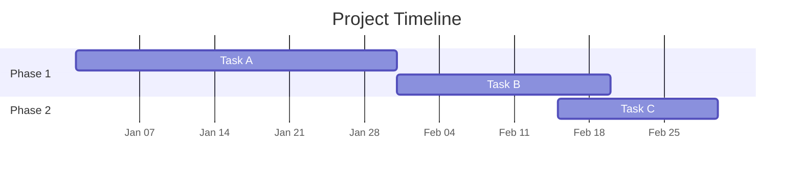
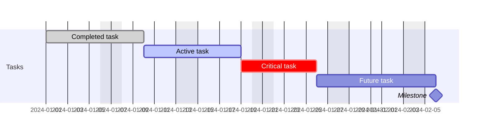
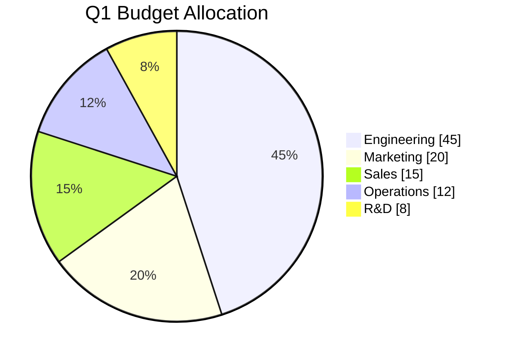
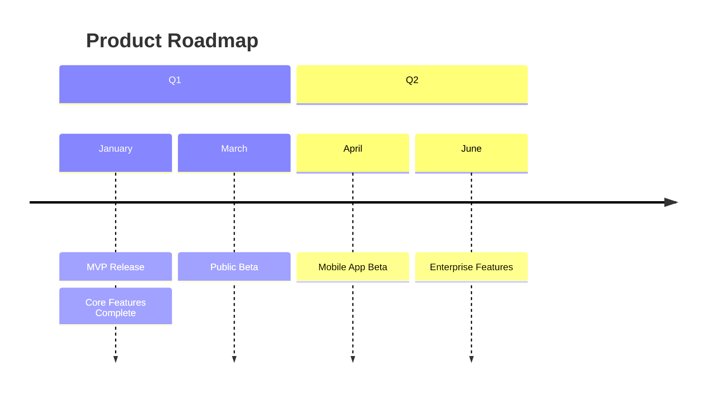
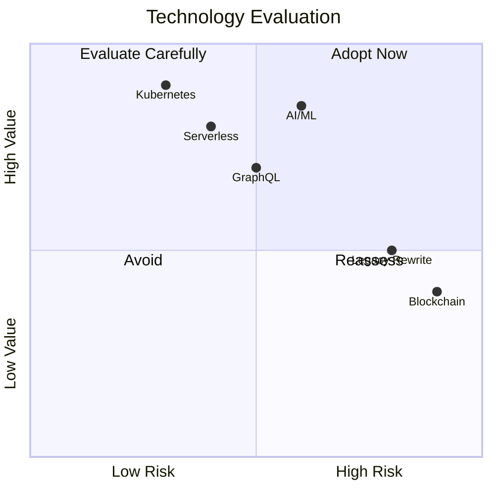
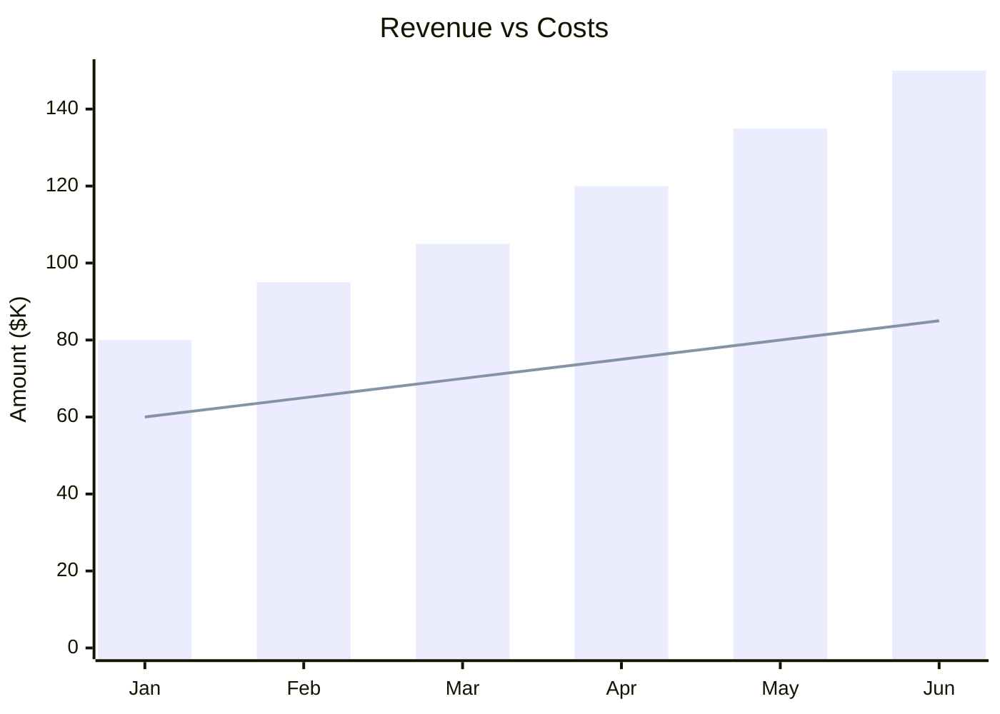
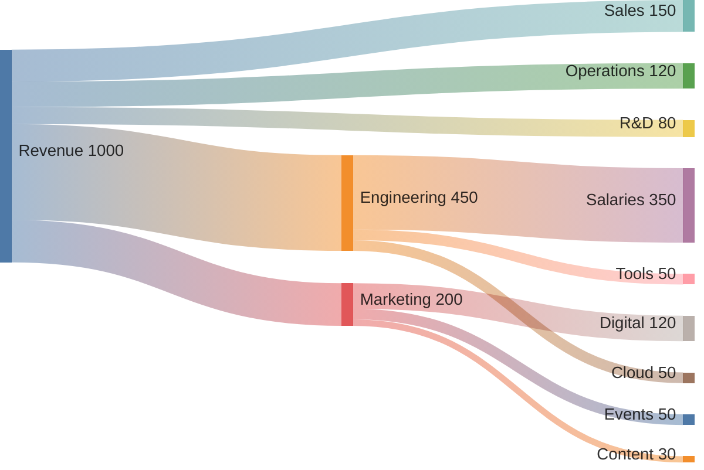
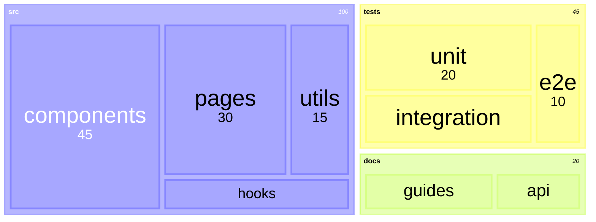
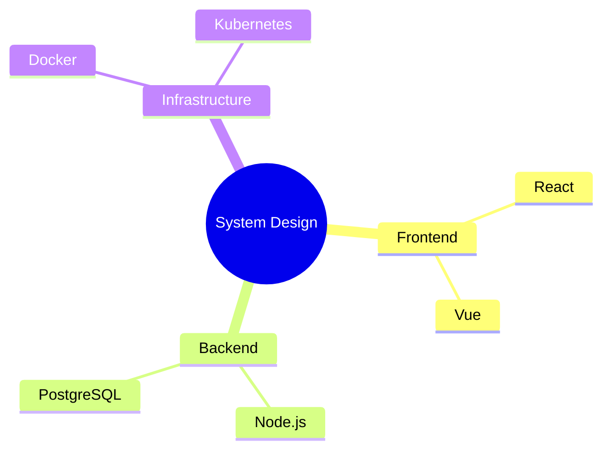
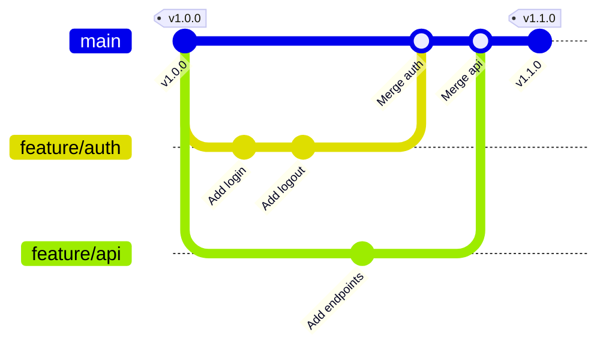

# Data Charts & Timelines

## Gantt Charts



### Date Formats

| Format | Example |
|--------|---------|
| `YYYY-MM-DD` | 2024-01-15 |
| `DD/MM/YYYY` | 15/01/2024 |
| `MM-DD-YYYY` | 01-15-2024 |

Axis format codes: `%Y` year, `%m` month (01-12), `%b` month abbr, `%d` day, `%a` weekday abbr.

### Task Syntax

```text
Task name : [tags], [id], [start], [end/duration]
```

| Tag | Effect |
|-----|--------|
| `done` | Completed (grayed) |
| `active` | In progress |
| `crit` | Critical path (red) |
| `milestone` | Milestone marker |



Dependencies: `after a b` waits for both `a` and `b`. Excludes: `weekends`, specific dates (`2024-12-25`), or weekday names.

## Pie Charts



`showData` displays values alongside the chart. Omit for labels-only.

## Timeline Diagrams



Multiple events per period: indent additional `: Event` lines under the same date.

## Quadrant Charts

Four-quadrant analysis (effort/impact, priority matrices).



Coordinates: `[x, y]` where both are 0-1. Quadrant 1: upper-right, 2: upper-left, 3: lower-left, 4: lower-right.

## XY Charts



Use `bar` for bar charts, `line` for line charts, or combine both.

## Sankey Diagrams



Format: `Source, Destination, Value` (one per line).

## Treemap Diagrams



## Mindmaps

Node shapes: `((Circle))`, `[Square]`, `(Rounded)`, `))Bang((`, `)Cloud(`, `{{Hexagon}}`



Hierarchy via indentation. Deeper nesting adds child nodes.

## Git Graphs



Commit types: `commit` (normal), `commit type: HIGHLIGHT`, `commit type: REVERSE`.
