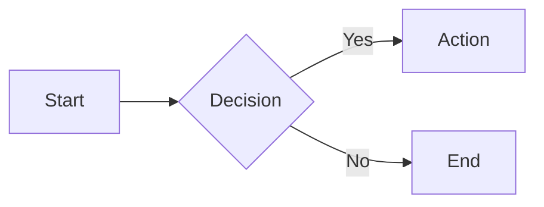
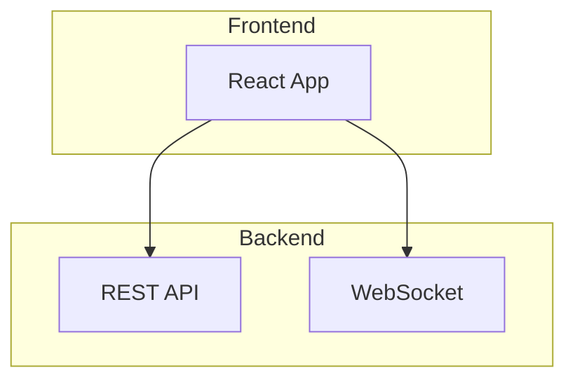
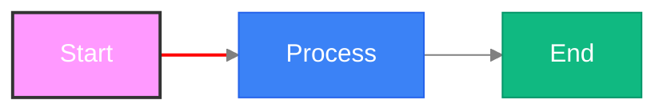
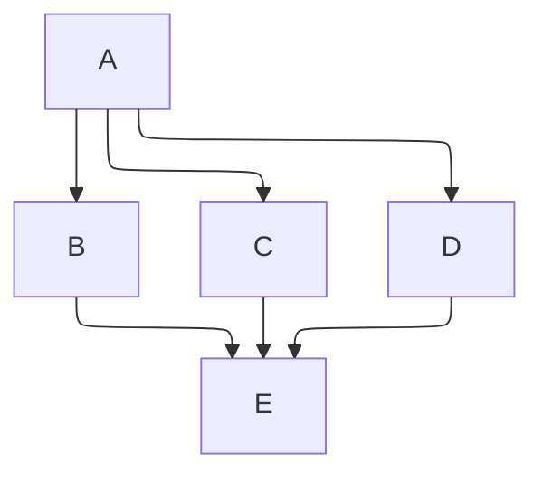
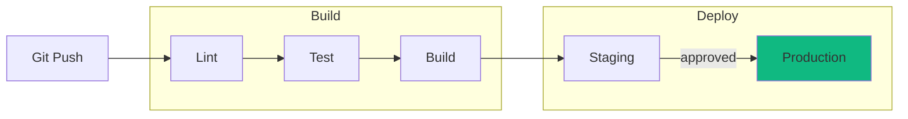

<!-- SPDX-License-Identifier: MIT -->
<!-- SPDX-FileCopyrightText: 2025-2026 Marcus Quinn -->

# Flowchart Diagrams

## Basic Syntax



**Direction:** `TB`/`TD` (top-bottom), `BT`, `LR`, `RL`

## Node Shapes

**Standard syntax:**
```
A[Rectangle]    B(Rounded)      C([Stadium])    D[[Subroutine]]
E[(Database)]   F((Circle))     G{Diamond}      H{{Hexagon}}
I[/Parallelogram/]  J[\Parallelogram\]  K[/Trapezoid\]  L[\Trapezoid/]
M(((Double Circle)))
```

**Extended syntax (v11.3+):** `node@{ shape: name, label: "Text" }`

| Shape | Description | Shape | Description |
|-------|-------------|-------|-------------|
| `rect` | Rectangle | `rounded` | Rounded rectangle |
| `stadium` | Pill | `subroutine` | Subroutine box |
| `cyl` | Cylinder | `circle` | Circle |
| `dbl-circ` | Double circle | `diamond` | Diamond |
| `hex` | Hexagon | `lean-r`/`lean-l` | Parallelogram |
| `trap-b`/`trap-t` | Trapezoid | `doc` | Document |
| `bolt` | Lightning bolt | `tri` | Triangle |
| `fork` | Fork | `hourglass` | Hourglass |
| `flag` | Flag | `comment` | Comment |
| `f-circ` | Filled circle | `lin-cyl` | Lined cylinder |
| `brace`/`brace-r`/`braces` | Curly brace(s) | `win-pane` | Window pane |
| `notch-rect` | Notched rect | `bow-rect` | Bow tie rect |
| `div-rect` | Divided rect | `odd` | Odd shape |
| `lin-doc` | Lined document | `tag-doc`/`tag-rect` | Tagged shapes |
| `half-rounded-rect` | Half rounded | `curv-trap` | Curved trapezoid |

## Edge Types

```
A --> B       Solid arrow        A --- B       Solid line
A -.-> B      Dotted arrow       A -.- B       Dotted line
A ==> B       Thick arrow        A === B       Thick line
A --o B       Circle end         A --x B       Cross end
A o--o B      Circle both ends   A x--x B      Cross both ends
A <--> B      Bidirectional
```

**Length:** Extra dashes extend: `-->` (normal), `--->` (longer), `---->` (longest)

**Labels:** `A -->|text| B` or `A -- text --> B` or `A -->|"multi word"| B`

**Animation (v11+):** `A e1@--> B` then `e1@{ animate: true, animation-duration: "0.5s" }`

## Subgraphs



Nested subgraphs supported. Override direction locally with `direction TB` inside a subgraph.

## Multi-Target Edges

`A --> B & C --> D` — fan-out; `E & F --> G` — fan-in

## Markdown in Labels

Wrap in backtick-quotes: `A["`**Bold** and *italic*`"]` — supports bold, italic, multi-line.

## Icons

`A[fa:fa-user User]` — FontAwesome prefix `fa:fa-name`

## Click Events

`click A href "https://url" _blank` — open URL; `click B call callback()` — JS callback

## Styling



## Layout Engine (ELK, v9.4+)



## Example: CI/CD Pipeline


