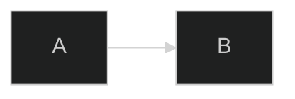
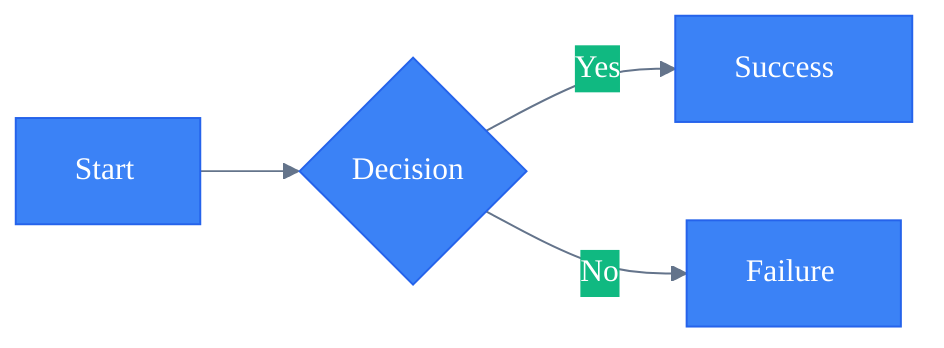
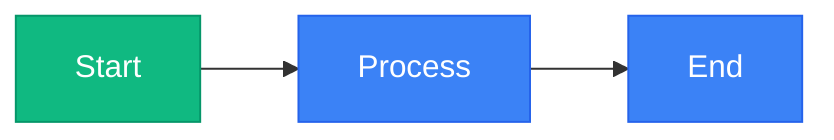
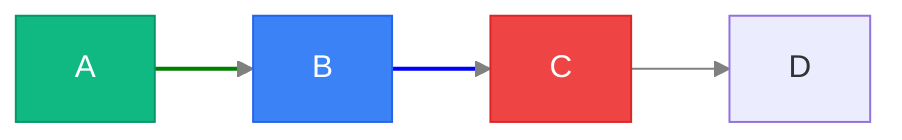
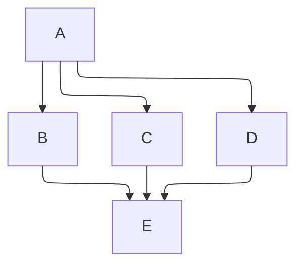
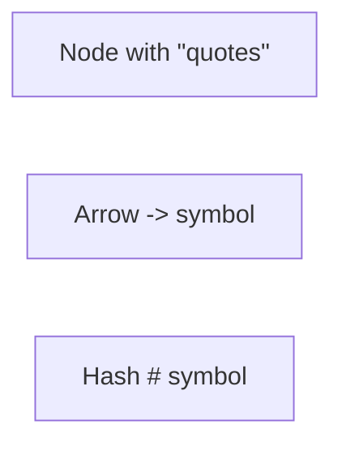
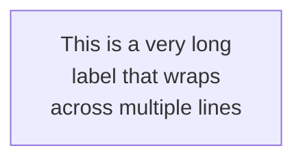

# Advanced Configuration & Styling

Theming, configuration, custom styling, and troubleshooting for Mermaid diagrams.

---

# Configuration

## Init Directive



Multi-line with theme variables:



## Frontmatter (alternative to init)

```yaml
---
title: My Diagram
config:
  theme: forest
  flowchart:
    defaultRenderer: elk
---
```

---

# Themes

| Theme | Description |
|-------|-------------|
| `default` | Default blue |
| `dark` | Dark mode |
| `forest` | Green |
| `neutral` | Grayscale |
| `base` | Base for customization |

---

# Theme Variables

## Core Variables

| Variable | Description |
|----------|-------------|
| `primaryColor` | Main node color |
| `primaryTextColor` | Text in primary nodes |
| `primaryBorderColor` | Primary node border |
| `secondaryColor` | Secondary elements |
| `tertiaryColor` | Tertiary/background |
| `lineColor` | Edge/arrow color |
| `textColor` | General text |
| `background` | Diagram background |
| `fontSize` | Base font size |
| `fontFamily` | Font family |

## Diagram-Specific Variables

**Flowchart:** `nodeBorder`, `nodeTextColor`, `clusterBkg`, `clusterBorder`, `edgeLabelBackground`

**Sequence:** `actorBorder`, `actorBkg`, `actorTextColor`, `activationBorderColor`, `activationBkgColor`, `signalColor`, `signalTextColor`, `noteBkgColor`, `noteBorderColor`, `noteTextColor`

**State:** `labelColor`, `altBackground`

**Gantt:** `gridColor`, `todayLineColor`, `taskTextColor`, `doneTaskBkgColor`, `activeTaskBkgColor`, `critBkgColor`, `taskBorderColor`

---

# Styling

## Class-Based



## Individual Node & Link Styling



### Style Properties

| Property | Example |
|----------|---------|
| `fill` | `fill:#3b82f6` |
| `stroke` | `stroke:#2563eb` |
| `stroke-width` | `stroke-width:2px` |
| `stroke-dasharray` | `stroke-dasharray:5,5` |
| `color` | `color:white` |
| `font-weight` | `font-weight:bold` |

---

# Layout & Directives

## ELK Renderer (v9.4+)

Better complex layouts, predictable edge routing, improved subgraph positioning.



## Common Init Options

```javascript
%%{init: {
  'theme': 'default',
  'flowchart': { 'defaultRenderer': 'elk', 'curve': 'basis', 'padding': 15 },
  'sequence': { 'showSequenceNumbers': true, 'actorMargin': 50, 'boxMargin': 10 },
  'gantt': { 'barHeight': 20, 'fontSize': 11, 'sectionFontSize': 14 }
}}%%
```

Directive keys: `flowchart`, `sequenceDiagram`, `classDiagram`, `stateDiagram`, `erDiagram`, `gantt`

---

# Security Levels

| Level | Description |
|-------|-------------|
| `strict` | Most secure, no HTML/JS |
| `loose` | Allows some interaction |
| `antiscript` | Allows HTML, blocks scripts |
| `sandbox` | iframe sandbox |


---

# Troubleshooting

## Special Characters

Escape with HTML entities or use quoted strings:



| Char | Entity | Char | Entity |
|------|--------|------|--------|
| `#` | `#35;` | `"` | `#quot;` |
| `<` | `#lt;` | `>` | `#gt;` |
| `&` | `#amp;` | `{` | `#123;` / `}` | `#125;` |

## Long Labels



## Arrow Syntax by Diagram Type

| Diagram | Sync | Async | Dotted |
|---------|------|-------|--------|
| Flowchart | `-->` | N/A | `-.->` |
| Sequence | `->>` | `-->>` | `-->>` |
| Class | `-->` | N/A | `..>` |
| State | `-->` | N/A | N/A |

## Debugging

- Verify diagram type declaration; check unclosed brackets/quotes; match arrow syntax to type
- Start minimal, add elements one at a time to isolate breaking change
- Live editor: https://mermaid.live — export PNG/SVG for guaranteed rendering across platforms

---

# Accessibility & Performance

**Accessibility:** Provide context text before diagrams for screen readers. HTML: `<div class="mermaid" role="img" aria-label="...">`.

**Performance:** Split large diagrams. Use ELK for complex layouts. Prefer class-based styling over inline. Cache renders; lazy load in documentation.

---

# Export

| Method | Command/Usage |
|--------|--------------|
| Live editor | PNG, SVG, Markdown at https://mermaid.live |
| Programmatic | `const svg = await mermaid.render('id', diagramText)` |
| CLI | `npx @mermaid-js/mermaid-cli -i input.md -o output.svg` |
