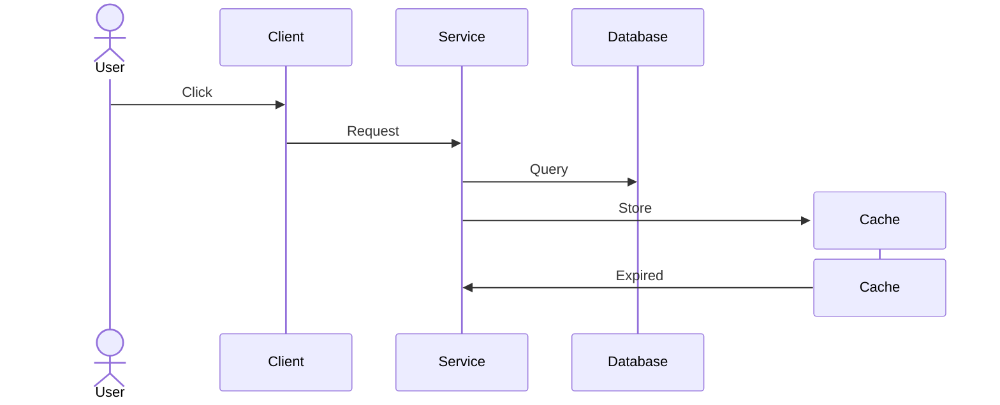
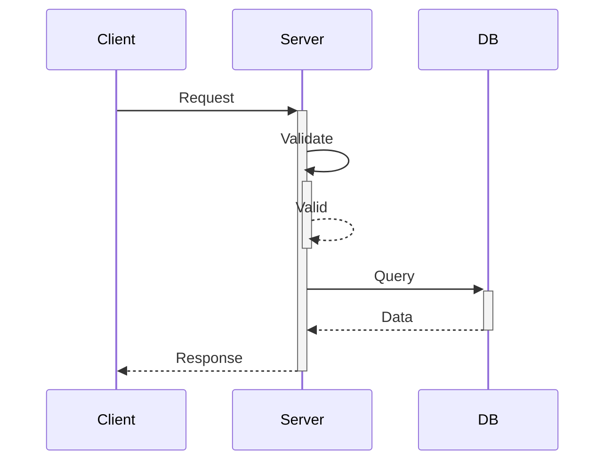
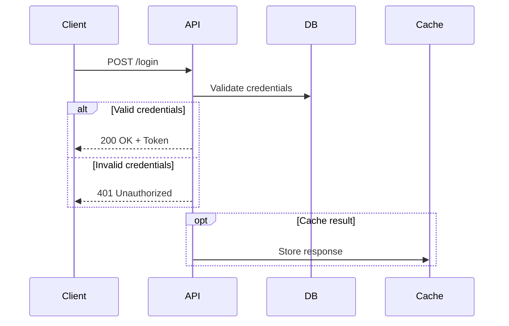
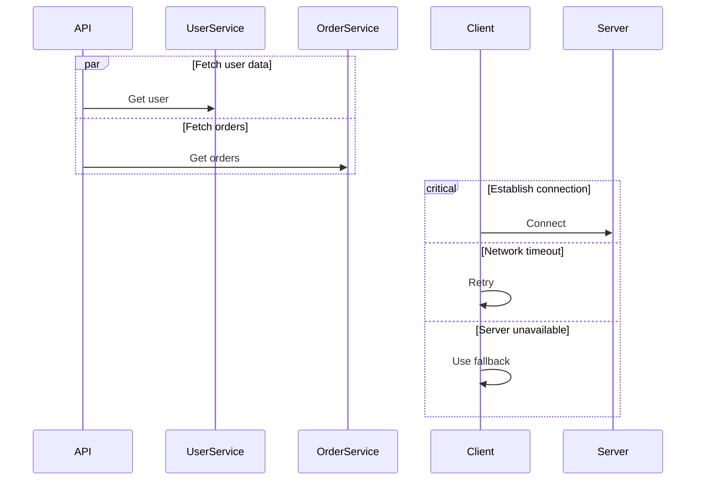
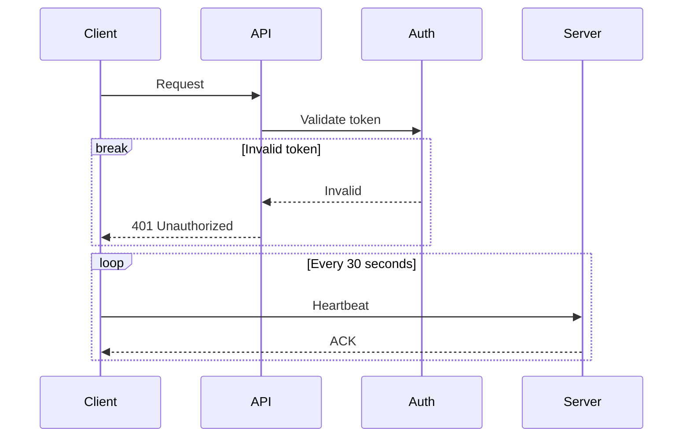
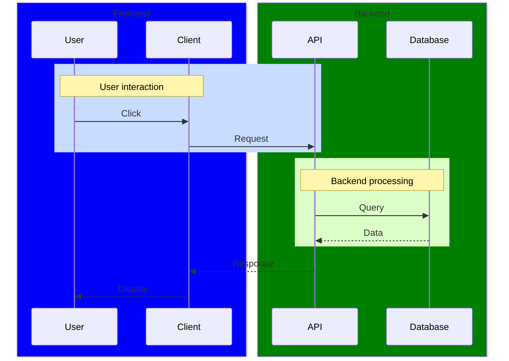
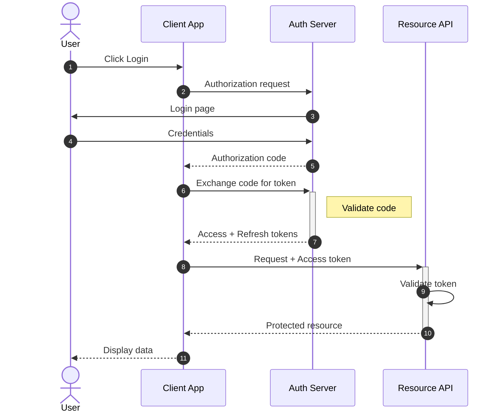
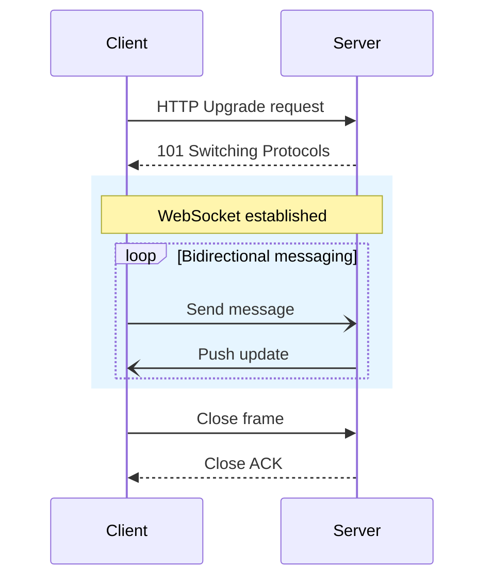
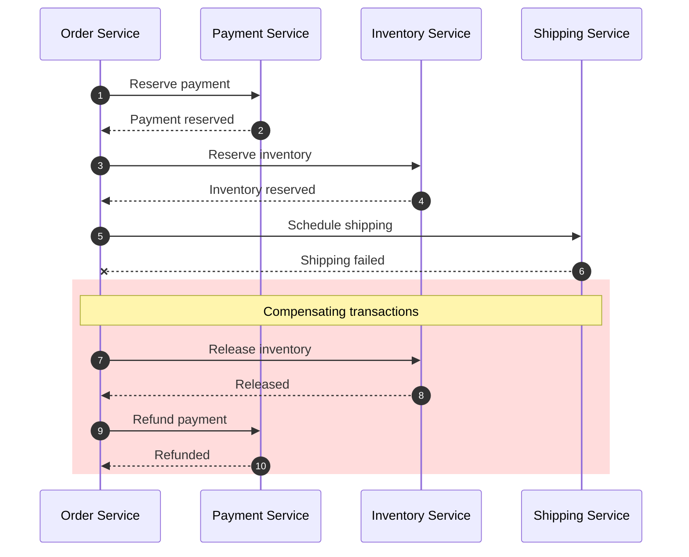
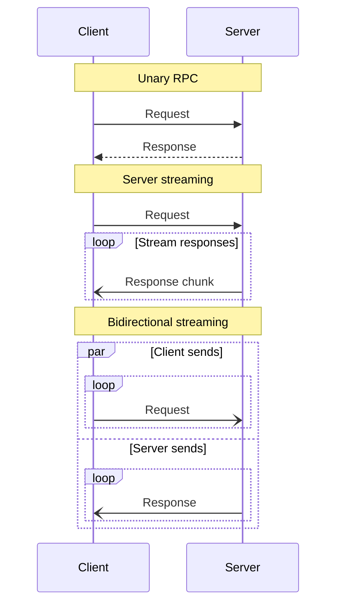

<!-- SPDX-License-Identifier: MIT -->
<!-- SPDX-FileCopyrightText: 2025-2026 Marcus Quinn -->

# Sequence Diagrams

Sequence diagrams show interactions between participants over time. Ideal for API flows, protocols, and service communication.

## Participants

Participants appear in order of first mention, or declare explicitly with aliases. Use `actor` for stick figures, `create`/`destroy` for dynamic lifecycle:

## Message Types

| Syntax | Description |
|--------|-------------|
| `->>` | Solid line with arrow (sync call) |
| `-->>` | Dotted line with arrow (response/async return) |
| `-x` / `--x` | Solid/dotted line with cross (failed) |
| `-)` / `--)` | Solid/dotted line with open arrow (async fire-and-forget) |
| `->` / `-->` | Solid/dotted line without arrow (rare) |

## Activation (Lifeline)

Use `+`/`-` suffixes on arrows for compact activation. Nesting supported. Equivalent explicit form: `activate`/`deactivate` on separate lines.

## Control Flow

Six constructs: `alt`/`else` (if/else), `opt` (optional), `loop`, `par`/`and` (parallel), `critical`/`option` (error handling), `break` (early exit).

## Styling and Layout

**Notes:** `Note left of A`, `Note right of B`, `Note over A`, `Note over A,B` (spanning).

**Autonumbering:** Add `autonumber` after `sequenceDiagram`.

**Background highlighting** with `rect rgb(R, G, B)` and **participant boxes** with `box Color Label`:

## Examples

### OAuth 2.0 Authorization Code Flow

### WebSocket Connection

### Saga Pattern (Distributed Transaction)

### gRPC Streaming

