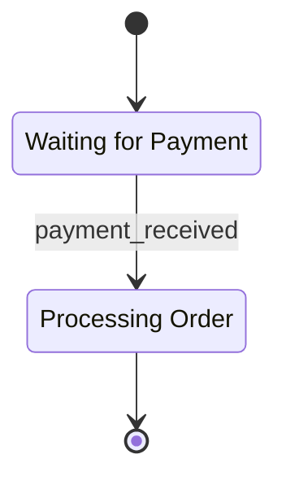
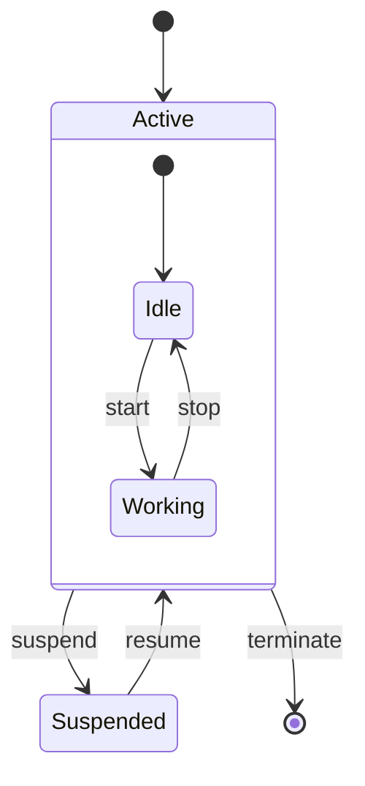
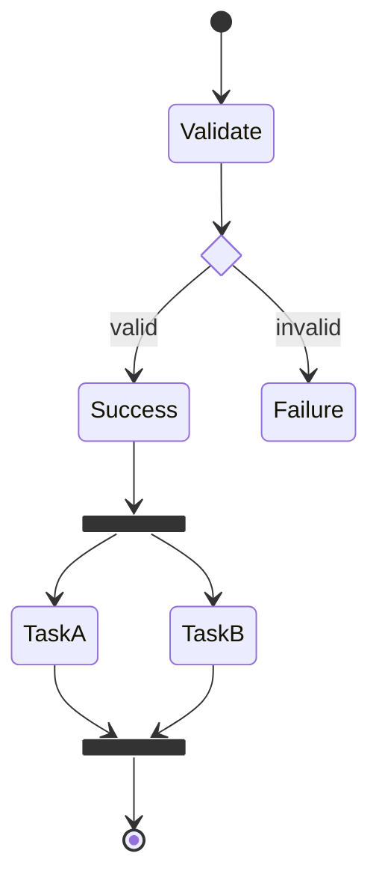
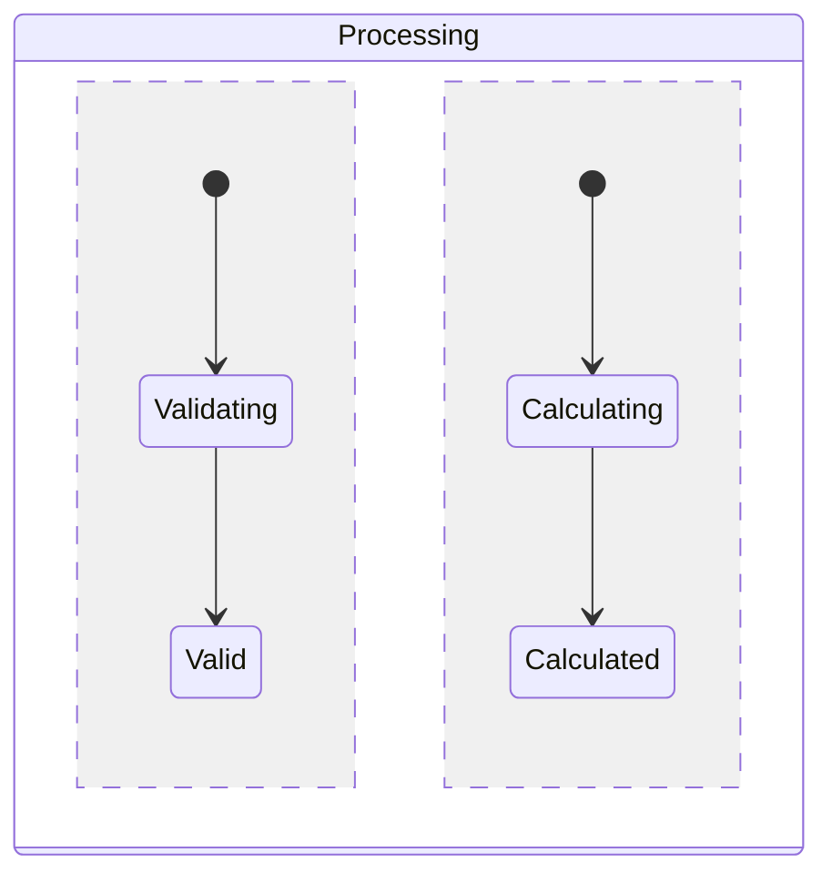
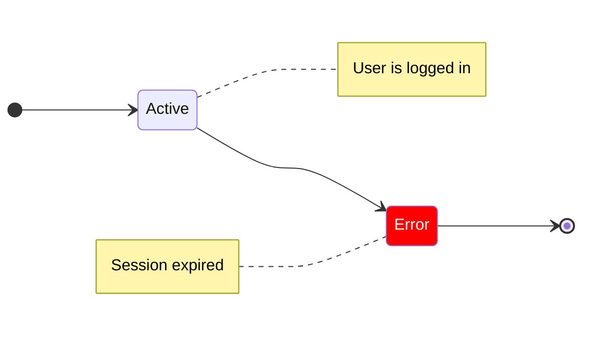
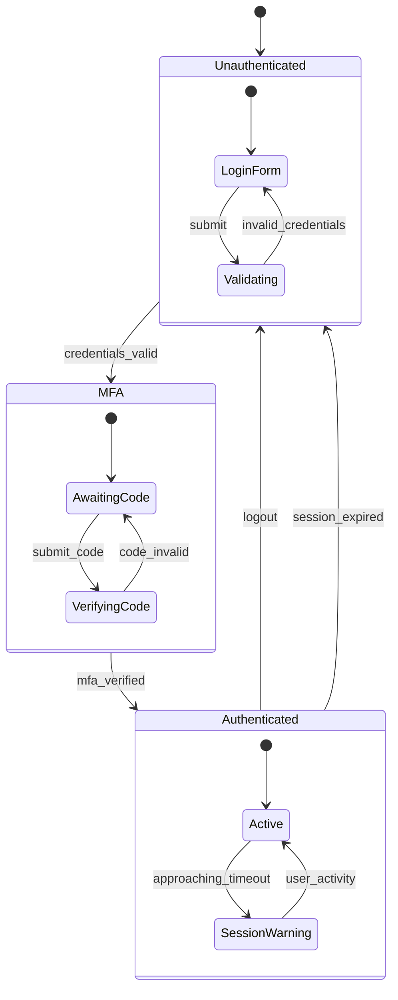
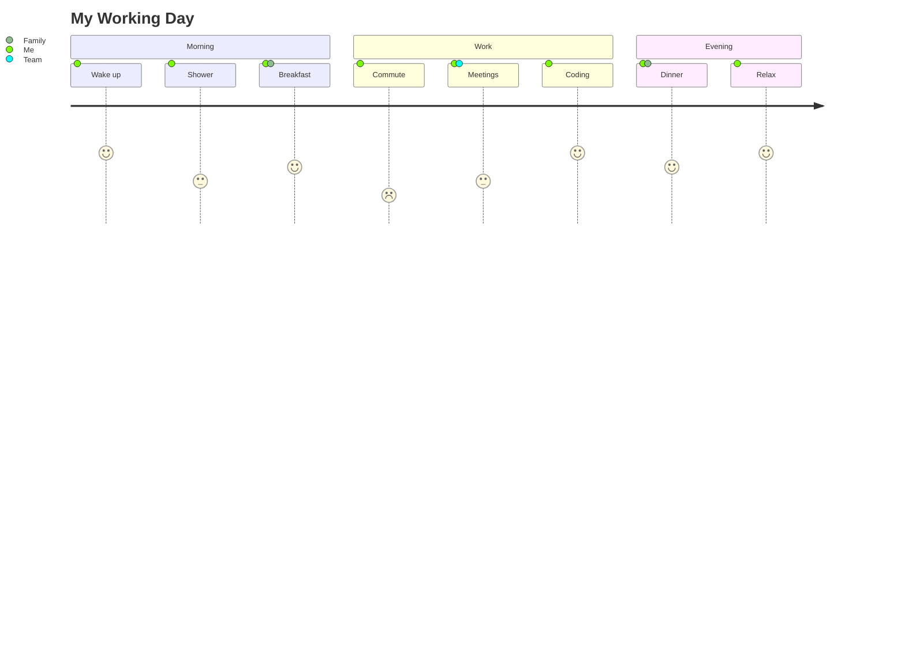
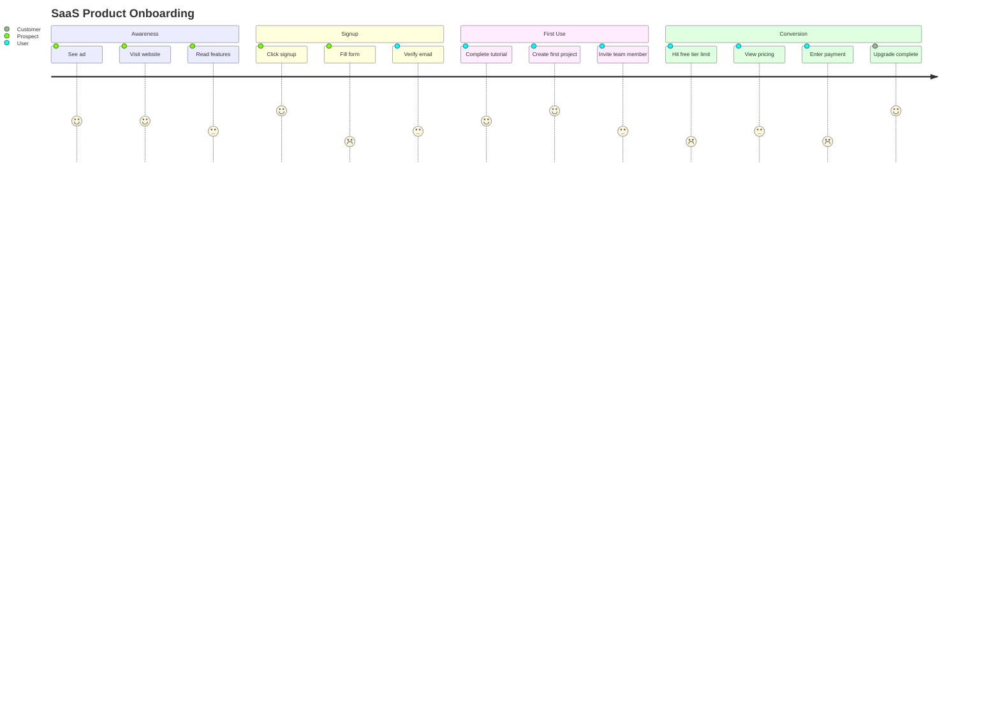

<!-- SPDX-License-Identifier: MIT -->
<!-- SPDX-FileCopyrightText: 2025-2026 Marcus Quinn -->

# State & User Journey Diagrams

State diagrams model state machines and lifecycles. User journey diagrams map user experiences across tasks.

## State Diagrams

### States & Transitions

Transition formats: `A --> B`, `B --> C : event`, `C --> D : event [guard]`, `D --> E : event / action`

Self-transition: `Processing --> Processing : retry`

### Composite States

### Choice, Fork/Join, Concurrent

Concurrent regions (parallel execution within a state):

### Notes, Direction, Styling

Direction options: `TB` (default), `BT`, `LR`, `RL`

### Example: Authentication Flow

---

## User Journey Diagrams

### Basic Syntax

Task format: `Task name: score: actor1, actor2, ...` — Score 1–5 (1 = negative, 5 = positive).

### Example: SaaS Onboarding

### Use Cases & Tips

**When to use:** UX research, identifying pain points, stakeholder communication, service design.

**Tips:** Keep scores realistic (not all 5s). Include multiple actors. Focus on emotional experience. Low-score points are improvement opportunities.
